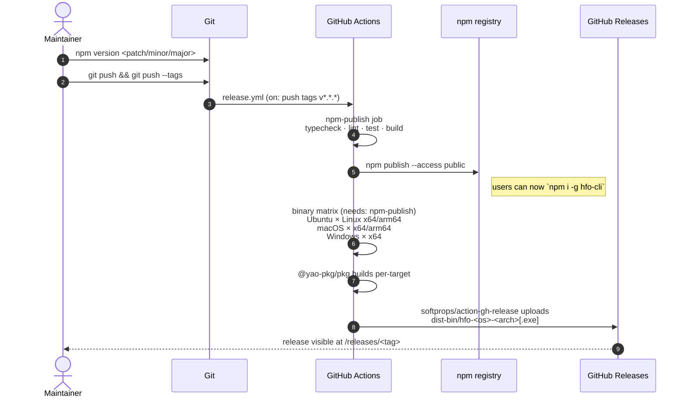

# Contributing to hfo

Thanks for wanting to help. `hfo` is a small, focused TUI — the bar for new code is
clarity and cross-OS reliability.

## Setup

```bash
git clone https://github.com/carrilloapps/hfo.git
cd hfo
pnpm install
pnpm dev
```

Prerequisites:

- **Node.js ≥ 20** (we rely on built-in `fetch`, `AbortSignal.timeout`, and modern
  ESM).
- **pnpm** (npm and yarn also work, but the lockfile is pnpm's).
- **Ollama** for end-to-end testing — installable from inside `hfo`.

## Where things live

```
src/                   → Strict-TypeScript source, grouped by layer
  cli.tsx · Shell.tsx · App.tsx · headless.ts   entry points (argv, tab router, install FSM, CLI dispatch)
  core/                                         pure domain logic — zero UI, zero OS side effects
  infra/                                        cross-OS platform integration (Ollama CLI, config dir, settings, package.json)
  ui/                                           UI-layer primitives (theme, i18n, icons, hooks, formatters)
  tabs/ · components/                           React/ink UI
test/                  → vitest suites covering src/core/, src/infra/, src/ui/
scripts/               → Build-time helpers (generate-favicons.mjs, install-skills.mjs)
docs/                  → Static site deployed to hfo.carrillo.app
.github/               → Issue forms, PR template, CI/CD, CODEOWNERS, dependabot, funding, support
```

New pure domain modules go under `src/core/`. Anything that needs the OS
(shelling out, filesystem, env vars) goes under `src/infra/`. UI primitives
shared across tabs/components go under `src/ui/`. Keeping these separate
makes the core logic trivially unit-testable and keeps cross-OS risk
contained.

See [README.md — Architecture](./README.md#architecture) for the full tree.

## Workflow

1. Open an issue first for non-trivial changes so we can align on scope.
2. Branch from `main`: `git checkout -b feat/<short-name>`.
3. Keep commits focused; a commit should describe the *why*, not just the *what*.
4. Run `pnpm build` before opening the PR — TypeScript must compile clean.
5. PR against `main`. Include a screenshot / screen-recording if you change the UI.

## Coding style

- **TypeScript strict mode**. Don't introduce `any` unless it's truly irreducible.
- **Cross-OS** is non-negotiable. Anything OS-specific belongs behind a platform
  switch (`src/platform.ts`, `src/ollama.ts`).
- **No emojis** in source strings. Use `src/icons.ts` (backed by the `figures`
  package) — it falls back to ASCII on legacy terminals.
- **English** for source identifiers, comments, and fallback UI strings. Add Spanish
  (or other) translations to `src/i18n.ts`.
- **No telemetry.** `hfo` must keep calling only the public HF API and local Ollama.

## Adding a tab

1. Create `src/tabs/<Name>Tab.tsx`.
2. Register it in `Shell.tsx` — append to `TAB_ORDER` and `labels`/`hotkey` maps.
3. Add a key hint string to `src/i18n.ts` under `hints.<name>`.
4. Update `README.md` keyboard section.

## Adding a theme

Add an entry in `src/theme.ts` with the full color map, then append to
`THEME_LIST`. The theme will show up automatically in the Settings tab.

## Releasing

Maintainers only. A single `git push --tags` triggers the full release
pipeline — npm first, then per-OS binaries.



```bash
npm version <patch|minor|major>
git push && git push --tags
```

The binary job is `continue-on-error: true`: if `pkg` can't bundle an ESM
dependency for a given target, only that artifact is skipped — the npm
release and the other architectures still succeed.

`prepublishOnly` runs the build for you.

## Recommended Claude Code skills (optional)

If you use Claude Code while working on hfo, a small set of skills dramatically
speeds up day-to-day contributions. **These are not committed to the
repository** — skills live under `~/.claude/skills/` and are user-local by
design (they churn independently of this project, belong to your Claude
Code configuration, and contain telemetry / authored-by metadata we don't
want in the public history).

Instead, run:

```bash
pnpm run skills:install
```

…which prints the full list, a one-line rationale per skill, and the exact
`/skill install <name>` commands you need to run from inside Claude Code.
The script is read-only — it never invokes Claude on your behalf.

| Skill | Why it helps |
| --- | --- |
| `react-ink` | API reference and usage patterns for `ink` components and hooks |
| `interface-design` | Critique + validation heuristics before you push a UI change |
| `brainstorming` | Structured exploration when scoping new tabs / flows / flags |
| `documentation-writer` | README, CONTRIBUTING, and docs-site polish conventions |
| `changelog-generator` | Release notes aligned with what tagged releases use |

If you contribute a workflow that depends on another skill, add it to
`scripts/install-skills.mjs` and this table.

## Code of conduct

Be kind. Assume good intent. Attack ideas, not people.
