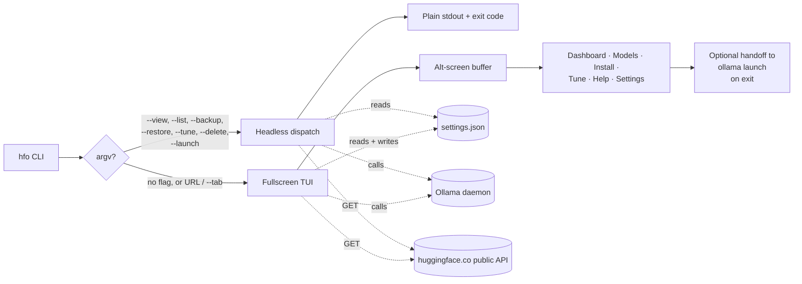
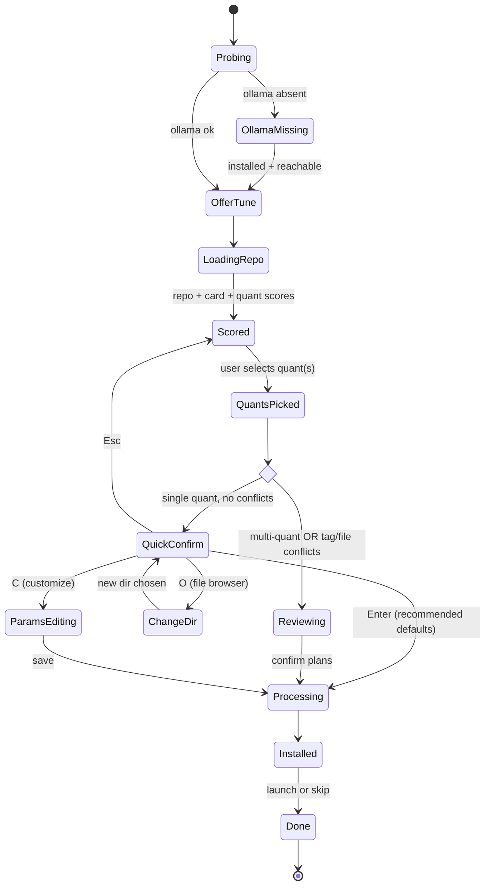
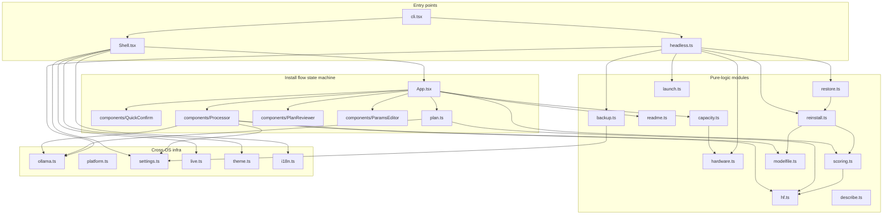

<div align="center">

# hfo

### Hugging Face · Ollama, in your terminal.

**A fullscreen TUI and headless CLI that turns any Hugging Face GGUF repository into a running,
hardware-tuned Ollama model — then lets you back it up, restore it, or hand it off to Claude Code,
Codex, Copilot CLI, OpenCode, Droid, and seven more integrations without leaving your shell.**

[Site](https://hfo.carrillo.app)  ·  [npm](https://www.npmjs.com/package/hfo-cli)  ·  [Releases](https://github.com/carrilloapps/hfo/releases)  ·  [Issues](https://github.com/carrilloapps/hfo/issues)

[](https://www.npmjs.com/package/hfo-cli)
[](./LICENSE)
[](https://nodejs.org)
[](https://github.com/carrilloapps/hfo/actions/workflows/ci.yml)
[](./tsconfig.json)

</div>

---

## Table of contents

- [Why](#why)
- [Install](#install)
- [Quick start](#quick-start)
- [Features](#features)
- [CLI reference](#cli-reference)
- [Keyboard reference](#keyboard-reference)
- [Configuration](#configuration)
- [Architecture](#architecture)
- [Development](#development)
- [Privacy, security, cost](#privacy-security-cost)
- [Roadmap](#roadmap)
- [Author](#author)
- [License](#license)

## Why

Running open-weight LLMs locally via Ollama is powerful but punishingly repetitive:

1. Browse Hugging Face. Pick a repo. Eyeball the quant table.
2. Guess which quant fits your VRAM. Read the card for temperature / top_p hints.
3. Download the `.gguf`. Hand-write a `Modelfile`. `ollama create` it.
4. Tune env vars (`OLLAMA_FLASH_ATTENTION`, `OLLAMA_KV_CACHE_TYPE`, …) differently on every OS.
5. Back it up. Restore it. Manage a dozen tags. Hand it off to Claude Code or Codex.

`hfo` collapses that into a single session. It reads your rig, scores every quant in the repo
against your VRAM and RAM, parses the model card for recommended sampling parameters, and — on the
happy path — installs a ready-to-run model with **one Enter keystroke**. Every TUI capability has a
non-interactive flag so you can script the same pipeline from CI, cron, or an editor plugin.

It is written in **strict TypeScript**, runs on **Windows / macOS / Linux**, talks only to the
public Hugging Face API and your local Ollama daemon, and ships as both an **npm package** and
**standalone binaries** for each OS.

## How it runs

Two entry points share the same engine — the fullscreen TUI for interactive
exploration and headless flags for scripts, cron, and editor plugins. Both
shells read the same settings file, write the same backup format, and invoke
the same Ollama commands underneath.



## Install

### npm (primary, cross-OS)

```bash
npm i -g hfo-cli
# or
pnpm add -g hfo-cli
# or
yarn global add hfo-cli
```

Requires Node.js **≥ 20**. Ollama is optional — `hfo` will install it for you via `winget`, `brew`,
or the official shell script if it isn't already on your PATH.

### Standalone binaries

Each tagged release on GitHub publishes self-contained executables for:

- Linux x64 / arm64
- macOS x64 / arm64
- Windows x64

Download the appropriate file from the [Releases](https://github.com/carrilloapps/hfo/releases)
page, make it executable, put it on your PATH, and you're done — no Node runtime required.

## Quick start

```bash
# Explore — fullscreen dashboard: hardware, capacity, picks, live metrics
hfo

# Install a specific repo (opens the Install tab pre-filled)
hfo bartowski/Llama-3.2-3B-Instruct-GGUF

# One-keystroke install, no TUI
hfo --view
hfo bartowski/Qwen2.5-Coder-7B-Instruct-GGUF --code
# (the new quick-confirm screen auto-accepts with Enter)

# Launch a coding agent wired to a local model
hfo --launch claude --model llama3.1:8b

# Back up a model folder
hfo --backup qwen2-5-coder-7b:q4-k-m

# Restore it later
hfo --restore ~/.config/hfo/backups/2026-04-23_11-48-25/qwen2-5-coder-7b_q4-k-m.zip
```

## Install flow (at a glance)

On the happy path a new install is three keystrokes: pick the quant, press
Enter, wait for the download. Conflicts and customisations branch off into
their own screens — no mandatory detours when there's nothing to decide.



## Features

- **Fullscreen TUI with six tabs.** Dashboard (live GPU / VRAM / RAM meters + loaded models +
  capacity tier), Models (installed + orphan-available-to-reinstall + loaded status), Install
  (quant picker + quick-confirm + file browser + plan reviewer + parameter editor), Tune
  (default vs suggested vs current env table), Help, and Settings.
- **Hardware scoring.** Every GGUF is graded 0–100 against your usable VRAM (GPU reserve subtracted)
  and RAM headroom, with per-quant labels like `Full GPU`, `Partial 87%`, `CPU-heavy`.
- **HF model-card parameters.** The README is parsed for recommended `temperature`, `top_p`,
  `top_k`, `repeat_penalty`, `min_p`, and context size — overlaid onto your hardware-tuned
  defaults, with a star marker on rows the card contributed.
- **Quick-confirm install.** New in this release: if the picked quant has no tag or directory
  conflicts, the install collapses to a single "Enter to install / O to change dir / C to
  customize" screen. Three-keystroke flow end to end.
- **Orphan reinstall.** Tags removed from Ollama but whose GGUFs still live on disk appear in a
  separate "Available to reinstall" section. `I` regenerates the Modelfile from the GGUF alone
  using your hardware + HF card and re-registers with Ollama.
- **Zip backup + restore.** Level-9 compression, streaming (multi-GB safe), metadata sidecar.
  `B` zips a model; `hfo --restore <zip>` extracts and re-registers, regenerating the Modelfile
  if needed.
- **Deep delete.** `d` removes the Ollama tag only; `Alt+d` also wipes the tracked directory.
- **Launch integrations.** Press `L` on any model to run `ollama launch <integration>` with that
  model as the backend. Supports Claude Code, Cline, Codex, Copilot CLI, Droid, Hermes, Kimi,
  OpenCode, OpenClaw, Pi, and VS Code, with runtime probing against `ollama launch --help` to
  mark unsupported targets.
- **~90% capacity tuner.** Side-by-side default / suggested / current for
  `OLLAMA_FLASH_ATTENTION`, `OLLAMA_KV_CACHE_TYPE`, `OLLAMA_KEEP_ALIVE`, `OLLAMA_NUM_PARALLEL`,
  `OLLAMA_MAX_LOADED_MODELS`, `OLLAMA_MAX_QUEUE`. Persists via `setx` on Windows,
  `launchctl setenv` + `~/.zprofile` on macOS, and `~/.profile` + `systemd` override on Linux.
- **Seven themes, 20 languages.** Dark, Light, Dracula, Solarized Dark/Light, Nord, Monokai.
  Translations in English, Spanish, Chinese, Hindi, Arabic, Portuguese, Bengali, Russian,
  Japanese, German, French, Korean, Italian, Turkish, Vietnamese, Indonesian, Polish, Dutch,
  Thai, and Ukrainian. Live language switching from the Settings tab.
- **Reusable searchable dropdown.** Themes, languages, and sort-order pickers all use the same
  keyboard-driven component — type to filter, arrow to nav, Enter to select.

## CLI reference

Every TUI capability ships a headless flag equivalent that prints plain text and exits with a
non-zero status on failure.

| Command | Description |
| ------- | ----------- |
| `hfo` | Open the fullscreen TUI (Dashboard tab) |
| `hfo <hf-url-or-repo>` | Open the TUI pre-filled on the Install tab |
| `hfo --help` / `-h` | Print the full flag reference |
| `hfo --version` | Print `hfo vX.Y.Z · MIT · <author>` |
| `hfo --view` | Print hardware profile, capacity score, tier, picks, pre-filtered HF search URLs |
| `hfo --list` | List installed models + orphaned GGUFs on disk |
| `hfo --tune` | Persist the ~90% capacity Ollama env profile, then restart the daemon |
| `hfo --backup <tag>` | Create a `.zip` backup of the model's folder with level-9 compression |
| `hfo --restore <zip>` | Extract a backup, regenerate the Modelfile if needed, re-register with Ollama |
| `hfo --delete <tag>` | Remove the tag from Ollama (shallow) |
| `hfo --delete <tag> --deep` | Remove the tag AND delete its on-disk folder |
| `hfo --launch <integration>` | Run `ollama launch <integration>` with the given model as backend |
| `hfo --tab <name>` | Open the TUI on `dashboard` · `models` · `install` · `tune` · `help` · `settings` |

Additional flags:

| Flag | Description |
| ---- | ----------- |
| `--dir`, `-d` | Base directory for the install file browser (default: `settings.modelDir`) |
| `--token`, `-t` | Hugging Face token for gated/private repos (or set `$HF_TOKEN`) |
| `--code`, `-c` | Mark the install as code-specialized (adjusts SYSTEM prompt) |
| `--ctx` | Force context size (default: auto — 8192 if fits in VRAM, else 4096) |
| `--model` | Model tag to pass to `--launch` |
| `--deep` | Deep-delete alongside `--delete` |
| `--no-fullscreen` | Disable the alt-screen buffer (helpful on legacy terminals) |

## Keyboard reference

| Scope | Keys | Action |
| ----- | ---- | ------ |
| Global | `1`–`6` | Jump to a tab |
| Global | `Tab` / `Shift+Tab` | Cycle tabs |
| Global | `,` | Open Settings |
| Global | `?` | Open Help |
| Global | `Ctrl+H` | Open the author's homepage |
| Global | `q` · `Ctrl+C` | Quit (restores scrollback) |
| Dashboard | `Alt+↑` · `Alt+↓` | Focus / cycle panels |
| Dashboard | `Esc` · `b` | Return to the 4-panel grid |
| Dashboard | `Enter` | Open the selected link in the default browser |
| Dashboard | `r` | Force refresh |
| Models | `↑` `↓` | Navigate rows |
| Models | `L` / `G` | Launch integration with selected model / Launch menu without preset |
| Models | `I` | Reinstall an orphan (regenerates Modelfile if missing) |
| Models | `B` | Create a `.zip` backup |
| Models | `d` / `Alt+d` | Remove tag / Remove tag AND delete files |
| Models | `r` | Refresh |
| Install (quick-confirm) | `Enter` | Install now with recommended defaults |
| Install (quick-confirm) | `O` | Change target directory |
| Install (quick-confirm) | `C` | Customize Modelfile parameters |
| Install (quick-confirm) | `Esc` | Back to the quant picker |
| Tune | `↑↓` · `←→` | Navigate rows · cycle enum values |
| Tune | `E` · `D` · `S` · `R` · `X` · `A` | Edit freely · Default · Suggested · Reset→suggested · Reset→defaults · Apply |
| Settings | `Enter` | Open dropdown (themes / 20 languages, searchable) |

## Configuration

`hfo` persists a JSON settings file under the OS-appropriate config directory:

- **Windows** — `%APPDATA%\hfo\settings.json`
- **macOS** — `~/Library/Application Support/hfo/settings.json`
- **Linux** — `$XDG_CONFIG_HOME/hfo/settings.json` (defaults to `~/.config/hfo/`)

Schema:

```ts
interface Settings {
  theme: 'dark' | 'light' | 'dracula' | 'solarized-dark' | 'solarized-light' | 'nord' | 'monokai';
  language: 'en' | 'es' | 'zh' | 'hi' | 'ar' | 'pt' | 'bn' | 'ru' | 'ja' | 'de'
          | 'fr' | 'ko' | 'it' | 'tr' | 'vi' | 'id' | 'pl' | 'nl' | 'th' | 'uk';
  refreshIntervalMs: number;         // Dashboard polling cadence
  defaultSort: 'trending' | 'downloads' | 'likes7d' | 'modified';
  defaultCodeMode: boolean;
  modelDir: string | null;           // Base dir for the file browser; null = platform default
  useAltScreen: boolean;
  installations: Installation[];     // { tag, dir, repoId, quant, installedAt }
}
```

Backups are written under `<configDir>/hfo/backups/<timestamp>/<slug>.zip` with a sidecar
`.metadata.json` containing tag, repo, quant, byte counts, and compression ratio.

## Architecture

Module layout, grouped by concern. Tests live under `test/`, UI components
under `src/components/`, tab containers under `src/tabs/`, everything else is
pure TypeScript suitable for unit testing and reuse.



## Layout

```
src/
├─ cli.tsx               # argv parsing, headless dispatch, alt-screen handoff, launch
├─ Shell.tsx             # 6-tab router: Dashboard / Models / Install / Tune / Help / Settings
├─ App.tsx               # install flow state machine (probe → score → pick → quick-confirm → process)
├─ tabs/                 # per-tab containers
├─ components/           # Dropdown · QuickConfirm · PlanReviewer · ParamsEditor · FileBrowser · LaunchMenu · ...
├─ hf.ts                 # public HF API client + resumable downloader
├─ hardware.ts           # nvidia-smi + systeminformation probes
├─ live.ts               # real-time samplers for Dashboard
├─ scoring.ts            # per-quant compatibility scoring
├─ capacity.ts           # overall hardware tier + picks + HF search URLs
├─ readme.ts             # HF model-card parser
├─ plan.ts               # install plans + conflict detection
├─ modelfile.ts          # Modelfile generator + tag slugifier
├─ reinstall.ts          # orphan detection + Modelfile regeneration
├─ backup.ts             # archiver-based zip writer + metadata
├─ restore.ts            # adm-zip reader + reinstall handoff
├─ launch.ts             # ollama launch targets + runtime probing
├─ ollama.ts             # CLI wrappers + cross-OS env persistence
├─ platform.ts           # openUrl + config dir (cross-OS)
├─ settings.ts           # persisted user preferences + installations index
├─ theme.ts              # 7-theme registry with contrast pairs
├─ i18n.ts               # 20-language translation catalogs
├─ describe.ts           # quant flavour + modality detection
├─ icons.ts              # figures-backed icon set
├─ about.ts              # package.json loader
├─ headless.ts           # non-interactive command implementations
├─ hooks.ts              # useTerminalSize / useInterval / useNow
└─ format.ts             # byte / ETA / progress bar formatters

test/                    # 12 suites, 71 vitest tests, v8 coverage
docs/                    # GitHub Pages site (hfo.carrillo.app)
```

## Development

```bash
git clone https://github.com/carrilloapps/hfo.git
cd hfo
pnpm install

pnpm dev           # run from source via tsx
pnpm build         # compile TS to dist/
pnpm typecheck     # tsc --noEmit (strict mode, all flags on)
pnpm lint          # eslint flat config with @typescript-eslint
pnpm test          # vitest (12 suites, 71 tests)
pnpm test:watch    # TDD mode
pnpm test:coverage # generate coverage/index.html
pnpm run ci        # typecheck + lint + test + build in one go
```

The CI workflow runs the same chain on Ubuntu / macOS / Windows × Node 20 / 22 for every push
and PR. The release workflow publishes to npm and uploads per-OS binaries to GitHub Releases
when a `v*.*.*` tag is pushed.

### Coding style

- **Strict TypeScript.** Every flag in `tsconfig.json` is on, including `strictNullChecks`,
  `noImplicitReturns`, `noFallthroughCasesInSwitch`, and `isolatedModules`.
- **No raw emojis in source.** Use `src/icons.ts` (backed by the `figures` package, with ASCII
  fallback on legacy consoles). ESLint guards this.
- **Cross-OS is non-negotiable.** Anything OS-specific lives behind `src/platform.ts` or
  `src/ollama.ts`.
- **No telemetry.** `hfo` only talks to the public Hugging Face API and the local Ollama daemon.
- **English source.** Spanish and 18 other languages live in `src/i18n.ts`.

See [`CONTRIBUTING.md`](./CONTRIBUTING.md) for the PR workflow and
[`CODE_OF_CONDUCT.md`](./CODE_OF_CONDUCT.md) for community guidelines.
Security issues: see [`SECURITY.md`](./SECURITY.md).

## Privacy, security, cost

`hfo` makes **exactly two kinds of external requests**, both to Hugging Face's public,
unauthenticated API:

```
GET https://huggingface.co/api/models/<repo>/tree/main
GET https://huggingface.co/<repo>/resolve/main/<file>
```

Everything else — `nvidia-smi`, `systeminformation`, `ollama ps`, `ollama create`,
`ollama launch` — runs locally. No telemetry. No accounts. Gated or private repos use a
standard `HF_TOKEN` environment variable or the `--token` flag.

The Ollama install helpers (`winget install`, `brew install`, the official shell script) run only
when the user explicitly opts in from the TUI's Ollama installer overlay.

All costs are zero: no subscriptions, no API keys, no rate-limited tiers.

## Roadmap

- [ ] Real-time progress in backup/restore for multi-gigabyte archives (pause / resume).
- [ ] Multi-install batch mode in `--install <file-with-repos>`.
- [ ] Snapshot diffing between two Modelfiles (for A/B testing parameter changes).
- [ ] Plugin API for custom launch integrations.
- [ ] Windows-native toast notifications when a long backup finishes.

Open an issue with the label `enhancement` to propose items.

## Author

**José Carrillo** — Senior Full-stack Developer (Tech Lead)

- Website — [carrillo.app](https://carrillo.app)
- Email — [m@carrillo.app](mailto:m@carrillo.app)
- GitHub — [@carrilloapps](https://github.com/carrilloapps)
- LinkedIn — [in/carrilloapps](https://linkedin.com/in/carrilloapps)
- X — [@carrilloapps](https://x.com/carrilloapps)
- Dev.to — [@carrilloapps](https://dev.to/carrilloapps)
- Medium — [@carrilloapps](https://medium.com/@carrilloapps)

## License

[MIT](./LICENSE) — © 2026 José Carrillo.
