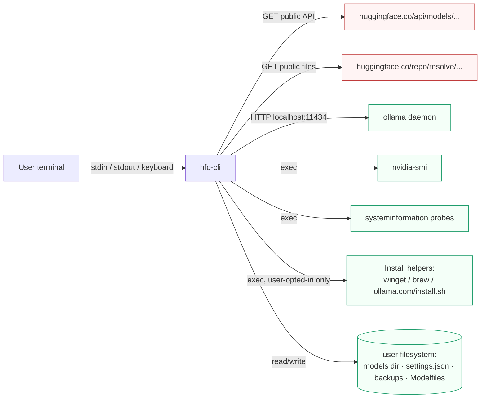

# Security Policy

## Supported Versions

| Version | Supported |
| ------- | --------- |
| 0.x     | yes       |

Because `hfo-cli` is under active development on the 0.x line, only the latest
published minor version receives security fixes. Pre-release tags are rebased
as new fixes land.

## Reporting a Vulnerability

If you believe you've found a security issue, please **do not open a public
GitHub issue**. Instead, report it privately in one of the following ways:

- Email <m@carrillo.app> with subject line `hfo security`
- Use GitHub's private vulnerability reporting: <https://github.com/carrilloapps/hfo/security/advisories/new>

Include:

1. A description of the vulnerability and its impact.
2. The version of `hfo-cli` you're running (`hfo --version`).
3. Operating system and Node.js version.
4. Steps to reproduce, a minimal test case, or a proof of concept.

You will receive acknowledgement within **72 hours**, and a resolution timeline
(or an explanation of why the issue is not eligible for a fix) within **7
days**. Public disclosure happens only after a patched version is published on
npm, following a coordinated disclosure window.

## Threat Model

The trust boundary is deliberately narrow: `hfo` talks to exactly two kinds of
remote resources (both public Hugging Face endpoints) and one local daemon
(Ollama). Everything else runs on the user's machine with the user's
privileges.

`hfo-cli` is a local developer tool. It does **not**:

- Run untrusted remote code. The only binaries it executes are `ollama`,
  `nvidia-smi`, and the OS install utilities (`winget`, `brew`, the Ollama
  install script, `systemctl`, `launchctl`) — all invoked with arguments the
  user can inspect in advance.
- Send any telemetry. The only network calls it makes are to
  `huggingface.co/api/...` (public, unauthenticated) and
  `huggingface.co/<repo>/resolve/...` (GGUF downloads). Gated repos optionally
  use a user-provided `HF_TOKEN`.
- Escalate privileges beyond what the host shell already has.

### In-Scope issues

- Arbitrary code execution via crafted HuggingFace repositories or Modelfiles.
- Path traversal during zip restore or file browser navigation.
- Unsafe deserialization of the settings JSON or backup manifests.
- Credential leakage (e.g. an `HF_TOKEN` being logged or persisted by
  accident).
- Cross-platform command injection in the `execa` wrappers (`ollama rm`,
  `setx`, `launchctl`, etc.).

### Out-of-scope

- Findings that require physical access to the user's unlocked machine.
- Vulnerabilities in upstream projects (Ollama, Hugging Face, Node.js, `ink`,
  `archiver`, `adm-zip`) — please report those upstream.
- Denial-of-service through very large user inputs on an unattended terminal.
